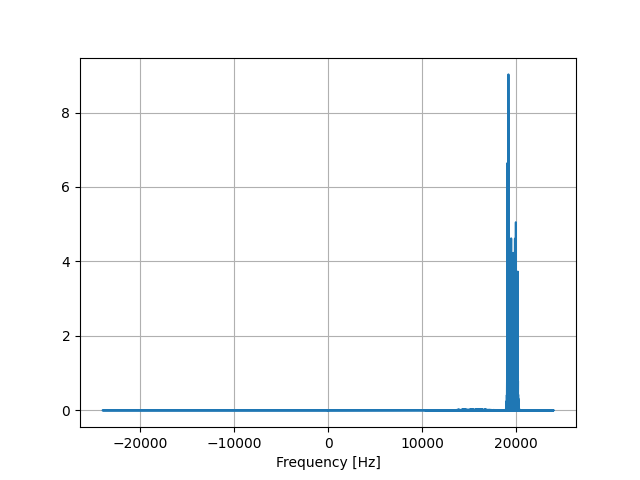

**If you know how to decode the signal further, write in [this thread on HN][ref_hn]**

Zoom uses [ultrasonic protocol][ref_zoom] to detect Zoom sessions nearby. If
you are near a conference set, you can check spectrum analyser (e.g.
[Spectroid][ref_spectroid] for Android) that there is constant signal around 19KHz.

I [recorded 74 seconds][ref_wav] of such signal from a conference room.

The sequence of actions during the recording was:

1. nothing, wait
1. 13 sec - click "share screen on laptop", connect
1. 30 sec - disconnect
1. nothing, wait
1. 47 sec - click "share screen on laptop", connect. The room name was "RASMXJ", I don't
remember if the previous room had the same name. 
1. 58 sec - disconnect
1. nothing, wait

Spectrogram of the original spikes around 20kHz.

Filtered with high-pass filter and decimeted shows clearly 12 bands spaced by 200Hz.

Spectrograms of the signal, chopped in 5-second intervals is as follows. Each
"bit" has ~72ms. The longer dips are connects and disconnects. If Zoom
broadcasts the meeting room ID, it must be in the signal before and after the
dips.

[ref_spectroid]:https://play.google.com/store/apps/details?id=org.intoorbit.spectrum&hl=en&gl=US
[ref_zoom]:https://support.zoom.us/hc/en-us/articles/214629303-Direct-sharing-in-Zoom-Rooms
[ref_wav]:./zoom_RASMXJ_20khz_2share.wav
[ref_hn:]:https://news.ycombinator.com/item?id=28571200
